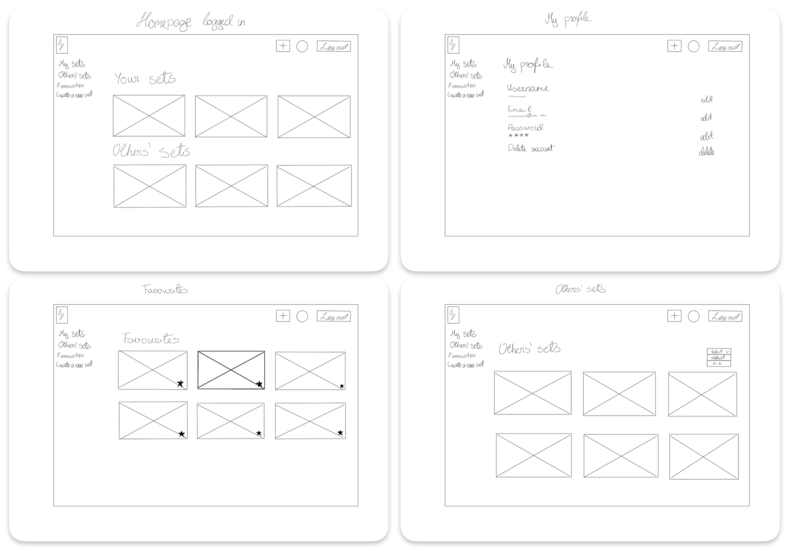
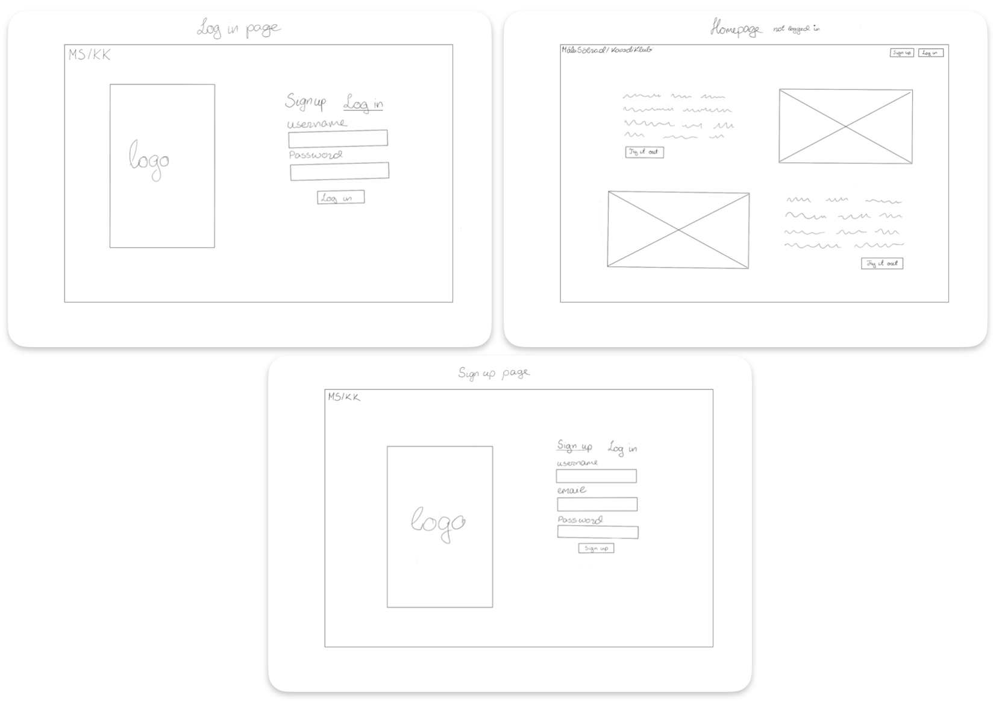

# Projekt: Mõistekaartide Rakendus

## Projekti Kirjeldus
Veebirakendus, mis võimaldab kasutajatel luua ja kasutada mõistekaarte õppimiseks. Kasutajad saavad lisada küsimusi ja vastuseid, luua eraldi teemapõhiseid kaarte ning jälgida oma edusamme.

Autorid:
Karmen Klaasen
Kryslin Rass

---

## Funktsionaalsuste Nimekiri

1. **Kasutaja konto loomine:**
   - E-maili sisestamine
   - Parooli sisestamine
   - Kasutajanime sisestamine

2. **Kasutaja sisselogimine:**
   - Kasutajanime sisestamine
   - Parooli sisestamine

3. **Lehtede vahetamine:**
   - Kasutaja saab liikuda lehtede vahel.

4. **Mõistekaartide komplektide loomine:**
   - Kasutaja saab panna komplektile nime.
   - Kasutaja saab sisestada mõisted ja definitsioonid.
   - Kasutaja saab lisada pilte definitsioonide juurde.
   - Kasutaja saab määrata komplekti privaatsuse (avalik/privaatne).

5. **Mõistekaartide komplektide kustutamine:**
   - Kasutaja saab oma loodud mõistekaartide komplekte kustutada.

6. **Mõistekaartide komplektide muutmine:**
   - Kasutaja saab oma loodud mõistekaartide komplekte muuta.

7. **Õppimine loodud mõistekaartidega:**
   - Kasutaja saab mõistekaarte edasi-tagasi ümber pöörata.
   - Kasutaja saab liikuda järgmisele mõistele ja tagasi.
   - Kasutaja saab märkida, kas mõiste on selge või segane (mõjutab õppimise protsenti).
   - Kasutaja saab valida, kas näha mõistet või definitsiooni.
   - Kasutaja näeb, kui palju kaarte on veel läbimata või läbitud.

8. **Mõistekaartide matchimine:**
   - Kasutaja saab sobitada mõisted ja definitsioonid.

9. **Teiste kasutajate loodud komplektide vaatamine:**
   - Kasutaja saab vaadata teiste kasutajate loodud komplekte.

10. **Filtreerimine ja sorteerimine:**
   - Kasutaja saab komplekte sorteerida (uus-vana, tähestik).

11. **Edusammude jälgimine:**
   - Kasutaja saab näha oma edusamme.

12. **Lemmikute lisamine:**
   - Kasutaja saab teiste kasutajate loodud komplekte lemmikuteks lisada ja neid eraldi alalehelt vaadata.

13. **Kasutaja komplektide leht:**
   - Alaleht, kus kuvatakse kasutaja loodud komplekte.

14. **Kasutaja profiili leht:**
   - Alaleht, kus kuvatakse kasutaja profiili andmed.

15. **Avalikud komplektid:**
   - Pealeht, kus kuvatakse avalikud komplektid (uuemad ees).

16. **Profiili muutmine:**
   - Kasutaja saab muuta oma profiili andmeid (e-mail, kasutajanimi, parool).

17. **Välja logimine:**
   - Kasutaja saab välja logida.

---

## Sprintide Ülevaade

### Sprint 1: 04.11 – 10.11
**Fookus:** Algus, baasmudel, kasutaja haldus  
- Kasutaja konto loomine ja sisselogimine  
- Andmebaasi ja Supabase ühendamine  
- Low-fidelity wireframe koostamine  
- Koodibaasi alustamine

### Sprint 2: 11.11 – 17.11
**Fookus:** Kasutajaliidese arendus ja põhifunktsioonid  
- Mõistekaartide komplektide loomine ja haldamine  
- Komplektide kuvamine ja muutmine  
- Andmete salvestamine Supabase’i andmebaasi  
- Õppimisfunktsioonide arenduse algus

### Sprint 3: 18.11 – 24.11
**Fookus:** Õppimisfunktsioonide täiustamine ja täiendav funktsionaalsus  
- Õppimislehe arendus  
- Matchimise funktsioon  
- Edukuse jälgimine ja statistika  
- Filtreerimise ja sorteerimise funktsioonide lisamine

### Sprint 4: 25.11 – 01.12
**Fookus:** Täiendavad funktsioonid ja profiilihaldus  
- Kasutaja profiili haldamine  
- Teiste kasutajate komplektide vaatamine ja lemmikuteks lisamine  
- Vead ja testimine

### Sprint 5: 02.12 – 08.12
**Fookus:** Lõppviimistlus, disain ja deploy  
- Rakenduse välimuse ja kasutajaliidese täiendamine  
- Lõplik testimine  
- Deployimine

---

## Low-fidelity wireframe

